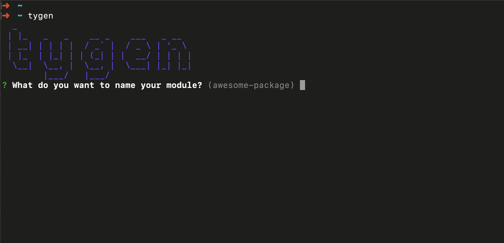
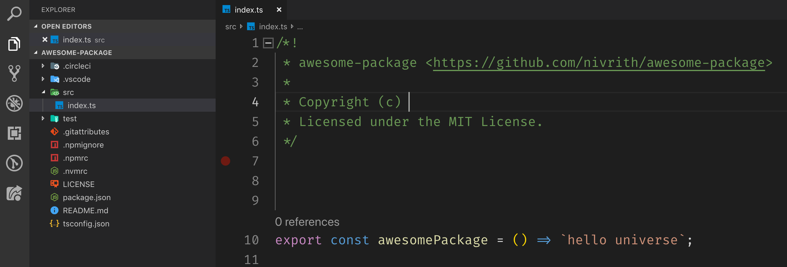

tygen
=====

Elegant release ready node module generator with typescript, testing, coverage and benchmarking

<!-- toc -->

# Usage

~~~md
$ tygen awesome-package # generates new package in folder awesome-package
  _
 | |_   _   _    __ _    ___   _ __
 | __| | | | |  / _` |  / _ \ | '_ \
 | |_  | |_| | | (_| | |  __/ | | | |
  \__|  \__, |  \__, |  \___| |_| |_|
        |___/   |___/
? What do you want to name your module? awesome-package
? What is your module description? My gnarly module
? What is your name? Nivrith
? What is your GitHub username? nivrith
? What is your email nivrithgomatam@gmail.com
🥁 Preparing cauldron...
🍕 Adding magic ingredients...
✨ Poof! awesome-package created!!

$ code awesome-package # open newly generated package in vscode

~~~

<!-- usage -->

<!-- commands -->
